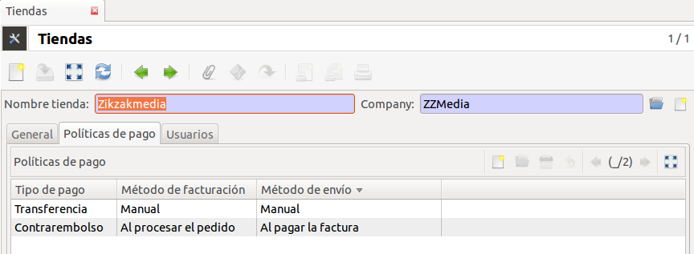

================
Política de pago
================

Puede seleccionar automáticamente el método de envío y el de facturación
configurando las políticas de pago. Esto le permitirá, en función del tipo de
pago seleccionado, introducir automáticamente los métodos de facturación y de
envío en los pedidos de venta.

Por ejemplo algunas configuraciones que puede tener son:

* **Contrareembolso**: Método de envío *Al procesar el pedido* y método de
  facturación *Manual*.
* **Pago TPV Virtual - electrónico**: Método de envío *Al procesar el pedido*
  y método de facturación *Al procesar el pedido*.

Estos dos ejemplos ilustran como dos tipos de pagos completamente diferentes
pueden personalizar los métodos de envío y facturación.

Para relacionar los tipos de pago con métodos de facturación y envío abra el
menú de configuración de tiendas, |menu_sale_shop|, y en la pestaña **Políticas
de pago** añada nuevas políticas de pago a la misma. Cada tienda tiene su
propia política de pago.

.. |menu_sale_shop| tryref:: sale_shop.menu_sale_shop/complete_name

Una vez configurada, cuando seleccione un tipo de pago en el pedido de venta,
los métodos de facturación y envío se cambiaran automáticamente según el tipo
de pago seleccionado y no se usaran los definidos por defecto de la tienda.
Si en la tienda no ha especificado ninguna política de pago, Tryton utilizará
los métodos de envío y facturación que la tienda tiene por defecto.

Si el cliente tiene asignado un tipo de pago por defecto, en el momento de
seleccionar un tercero en el pedido de venta, este añadirá un tipo de pago al
pedido (el por defecto del cliente) y al mismo tiempo cambiará los métodos de
envío y facturación según el tipo de pago especificado en la tienda.

Módulos que dependen
====================

Instalados
----------

.. toctree::
   :maxdepth: 1

   /sale/index
   /sale_shop/index

Dependencias
------------

* Ventas_
* Tienda_

.. _Ventas: ../sale/index.html
.. _Tienda: ../sale_shop/index.html
 